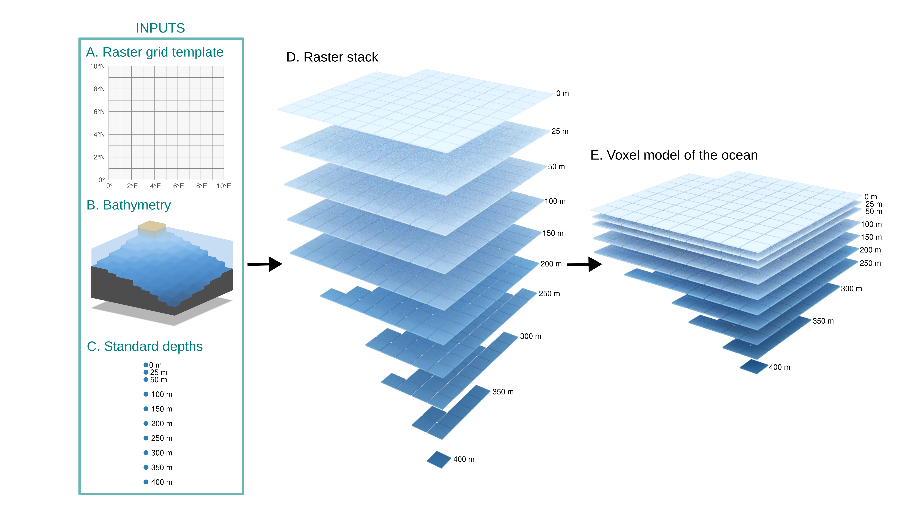
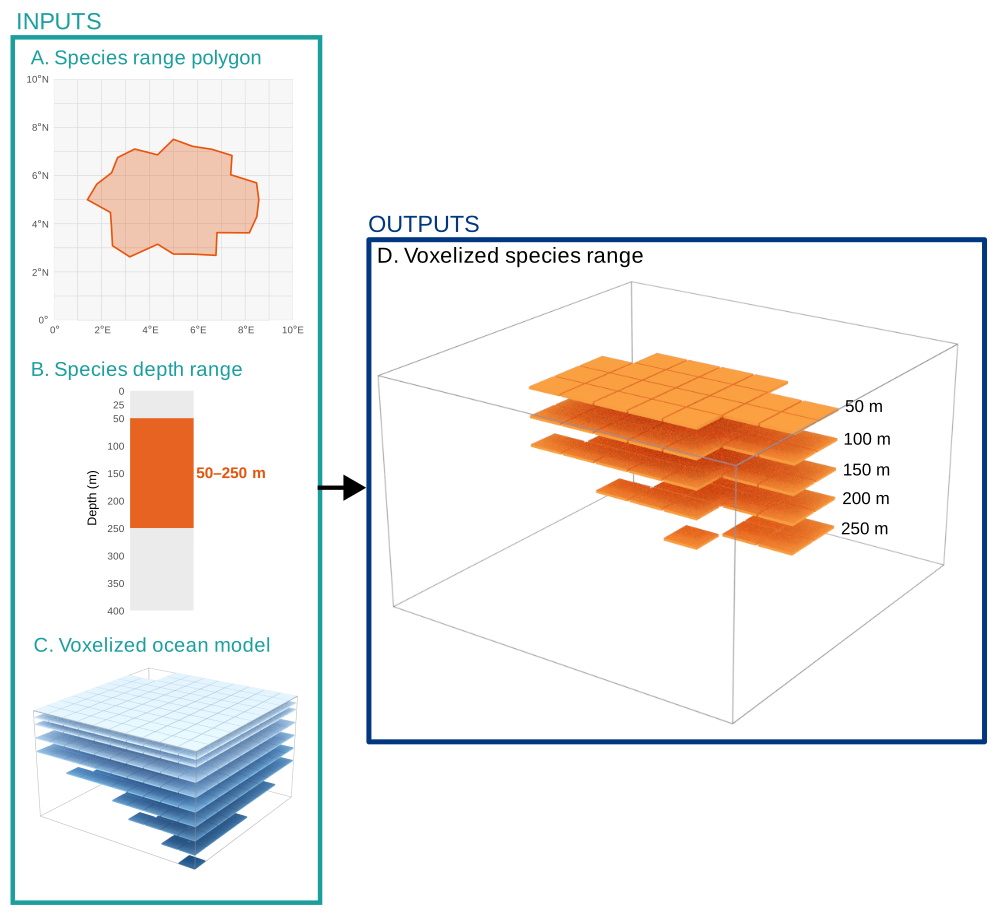

# **Project Spec**

This document describes the overall design decisions for the `sharkabc3d` (Shark and Ray Abiotic Covariates in 3 Dimensions) project. `sharkabc3d` is an R package that is designed to facilitate the analysis of marine habitats in 3D, enabling descriptions of interaction between different marine entities, including species, anthropogenic activities, and environmental variables. `sharkabc3d` is intended to empower users to conduct analyses in the 3D marine environment within the R ecosystem. 

The primary operation that `sharkabc3d` is focused on is the spatial querying of large 3D marine datasets. `sharkabc3d` enables asking questions like 
1. What range of environmental conditions is a species found in? 
2. How much does a given anthropogenic activity affect a species? 
3. What impact could protective measures have on a species?

while considering three-dimensional space. 

Technically, this means that `sharkabc3d` needs to be able to take 1D (points), 2D (polygons), and 3D (raster stack) and query how these intersect with one another. 

## Vector Representations in 3D space
For more background: https://en.wikipedia.org/wiki/Geometric_primitive
### 1D (Points / Vertices)
Points need to have 3 coordinate values to be able to be located in 3D space. They are called vertices in the 3D graphics / modelling field. 

For `sharkabc3d`, these will be lon (longitude), lat (latitude), and depth (metres). 

### 2D (Lines / Edges)
Lines are two points connected, having a length but no width. These are called edges in the 3D graphics / modelling field. 

Currently, `sharkabc3d` doesn't handle lines / edges, but it would be useful for working with things like fishing boat routes or tagging data. 

### 2D (Polygons / Faces)
Polygons are constructed from points that exist on the same 2D plane, that are connected in order that creates a closed shape. In 3D graphics / modelling field, they are called faces. 

Currently, `sharkabc3d` doesn't handle faces that are natively 3D. These are cases where each point that is part of the polygon has a meaningful depth coordinate. Instead, we work with polygons that have depth values associated with the entire polygon. I.e. the polygon is represented on planes that aligned with depth levels. For example, IUCN Red List species ranges that have a species range represented as a 2D polygon with no depths, with separate depth range values provided. This is often called 2.5D representation. 

### 3D (Volumes)
Volumes are closed geometries that are formed by multiple polygons. 

Currently, `sharkabc3d` does not handle volumes. This might become useful to work with if we input 3D models, derived from techniques like photogrammetry. 

## Raster Representations in 3D space

### 2D (Raster) 

2D rasters are cellular representations with x, y dimensions. I.e. the whole study space is represented as a grid that has values in every cell. 

### 3D (Voxel)

To extend rasters into 3D, we simply create multiple rasters for a set of standard depths. This is the convention from oceanography datasets, like Copernicus Marine and World Ocean Atlas. This raster stack is supported with netCDF file type and with the `terra` and `ncdf4` packages. This raster stack is called a **voxel model** in 3D graphics / modelling field. 

Multi-depth rasters used by `sharkabc3d` must encode depth in layer names using the format `{variable}_{field}_depth={value}` (e.g., `t_an_depth=0`, `t_an_depth=100` for temperature with annual means at 0 and 100 m depths). This is the convention used by WOA NetCDF files natively. For the earlier example, it would mean that the first `t_an_depth=0` layer has a height of 100m. The convention for `sharkabc3d` voxel model is that the shallower raster layer name is the start of the voxel and continues until, but not including, the next deeper raster layer. 

In these rasters, there is a continuous representation of values across x, y, and depth dimensions. For environmental variables, this could be temperature in degrees C at each coordinate and depth. For a species range, this could be probability of occurrence at each coordinate an depth. 

Data source utilities are responsible for converting other formats into this convention. Functions like `extract_rast_volume()` parse layer names to determine which depth layers to select for a given depth range.

### 3D (Min-max 2.5D)

Colloquially referred to as the 2.5D model, this is often used for terrain models in GIS. Think like Digital Elevation Models, where the raster values correspond with the height of the landscape. 

We can represent spaces, like species ranges, by describing the space that they occupy with a minimum depth and maximum depth raster. Maximum depth could be bound by the bathymetry raster, or by the maximum depth the species is found at. 

This representation is more efficient than the 3D Voxel representation, since it only needs two rasters for min and max respectively, compared to needing a raster for every standard depth. The downside is that the 2.5 representation doesn't model situations where there may not be presences between the min and max depths. 

## `sharkabc3d` functionality

### Spatial extractions 
- **Point extraction**. Extract the nearest value to input point (ex. single observation) from voxel data (ex. oceanographic variables)
- **Area extraction**. Extract the values that are within a polygon area (ex. species range without depths) from voxel data (ex. oceanographic variables)
- **Volume extraction**. Extract the values that are within a volume (ex. species range with depths) from voxel data (ex. oceanographic variables)
  - This should be possible for both 2.5D (two-raster stack) and 3D (multi-depth raster stack). 

### Conversions between spatial representations
- **Create template voxel grid for study space**. Create the 3D voxel grid for the study space, that can be used as a template to convert other spatial representations to be compatible with it. 
- **Convert 2D polygons with depth data to 2.5D.** When separate depth ranges are available, use that to convert 2D polygons into 2.5D representations that are bound by bathymetry and depth ranges. Ex. IUCN Red List species ranges. 
- **Convert 2D rasters to 2.5D**. When depth ranges are available, use that to convert 2D raster data into 2.5D representations. Ex. working with Global Fishing Watch data on fishing effort by gear type.

### Volume calculations 
- **Calculate the volume occupied by 2.5D representation**. Each rasterized range stores presence plus `depth_min/depth_max` per cell, clamped to the seafloor. Volume is the sum of `cell_area × (depth_max - depth_min)` over present cells; overlap between two ranges is the same arithmetic on the intersected depth window.
- **Calculate the volume occupied by 3D representation**. Each raster layer has a height that it represents, which is defined by the height difference from the next raster layer. Ex. `t_an_depth=0`, `t_an_depth=100` would mean that the first `t_an_depth=0` layer has a height of 100m. 

### Utilities 
- **Download and prepare data.** Utilities for public APIs and open data incorporated into `sharkabc3d`. Includes World Ocean Atlas, Copernicus, IUCN Red List, Global Fishing Watch data. 
- **Downloads are cached, not manual.** Downloaded big data is cached in location accessible by package functions. Different projects read off the same copy of the data. Keeps analysis reproducible while compact. Data is automatically documented, so that the code can be handed to another user with download functions that handle the caching. 

## Conventions
- **Depth sign convention.** Depths are positive metres increasing downward, but GEBCO bathymetry is negative below sea level. The voxel constructor flips it and clamps land to 0. Document which convention any new argument uses.
- **`ncdf4` vs `terra`**. Work with `ncdf4` package to read netCDF directly for extraction of point data. Work with `terra` for large raster operations (1000s of cells), like extracting areas / volumes. 

## Future directions

These come after the sections above are established, and are not grounded in existing project code.

### 3D species distribution modelling

Create 3D species distribution models from point observations, combining horizontal (X, Y) occurrence data with vertical (Z) depth information — extending traditional 2D SDMs by incorporating depth as an explicit dimension. 

- `create_3d_sdm(occurrences, bathymetry, env_rasters, depth_breaks)` — Build a 3D species distribution model from point observations with depth (X, Y, Z). Fits a model (e.g., MaxEnt, GLM) at each depth layer using environmental covariates extracted at that depth. Returns a multi-layer SpatRaster of predicted habitat suitability by depth.
- `predict_3d_habitat(model, env_rasters, depth_breaks, bathymetry)` — Generate 3D habitat suitability predictions from a fitted model. For each depth layer, extract environmental values and predict suitability. Mask cells where depth layer exceeds bathymetry. Returns multi-layer SpatRaster.
- **Handle spatial-autocorrelation in 3D**. Spatial autocorrelation in 2D is known challenge, tools in spatial modelling exist to handle. Need to investigate what is available / possible for spatial-autocorrelation in 3D. 
